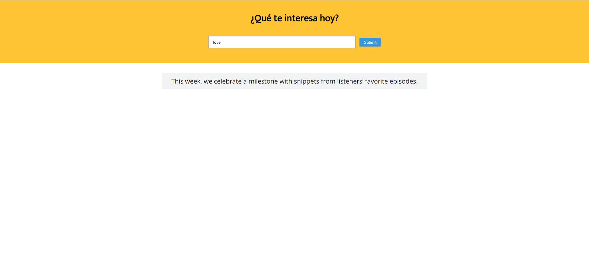

# **XHR Project Demo**



## **Objetivo**

Esta aplicación web tiene como objetivo brindar un artículo al usuario según la palabra clave que haya ingresado en el buscador.

## **Herramientas Tecnológicas**

* HTML5

* CSS3

* Javascript

* AJAX

* XHR

* API del diario New York Times(me permite acceder a los artículos de su base de datos.)

* NPM

* Git

* Gitignore

## **Flujo de la Aplicación**

* El usuario escriba alguna palabra clave relacionada al artículo que quiere buscar.

* Da click al botón ```Submit```.

* Le aparece un artículo de lo que busca.